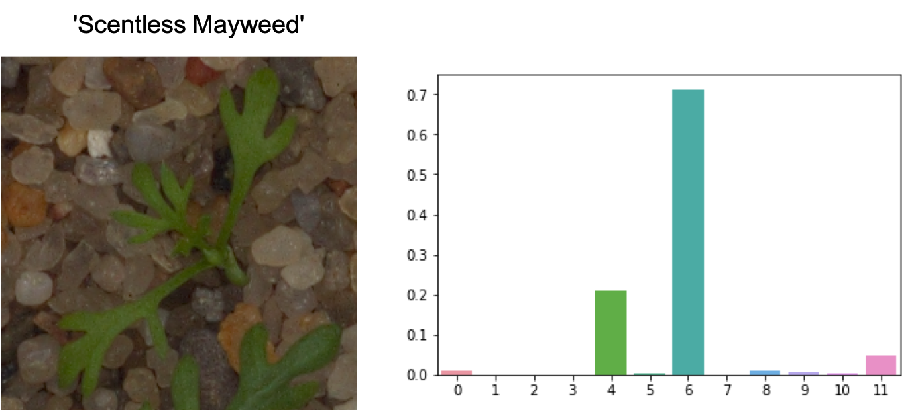
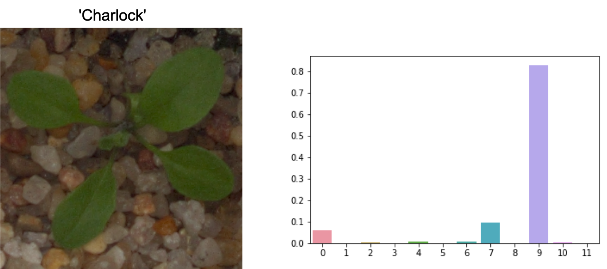
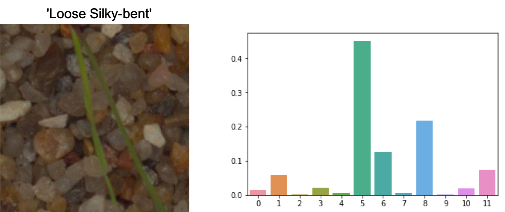
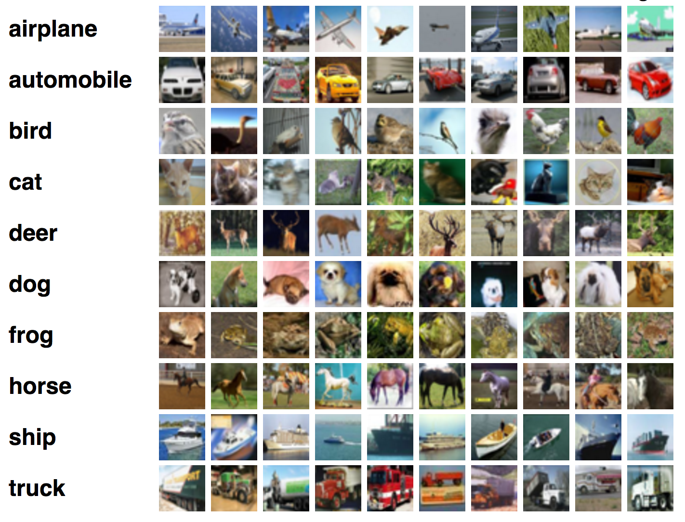
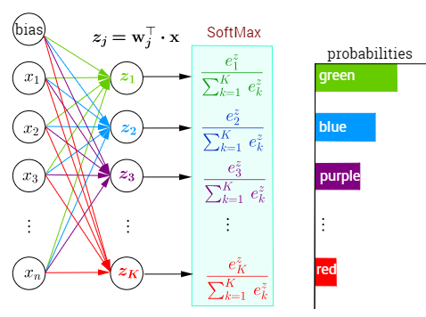
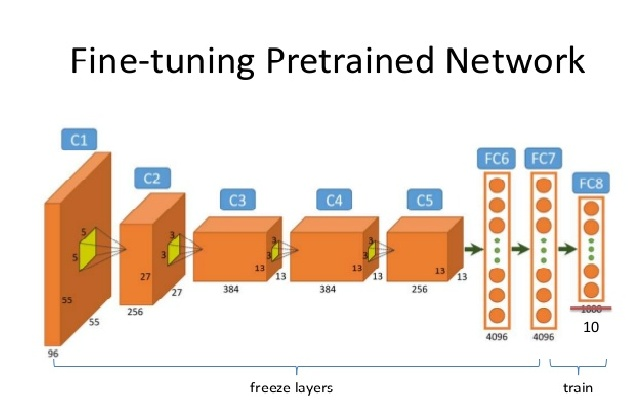
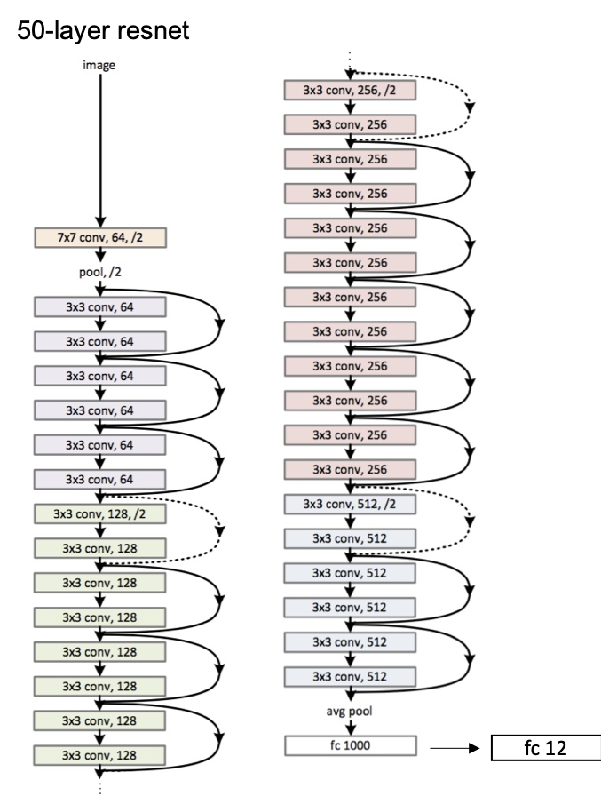
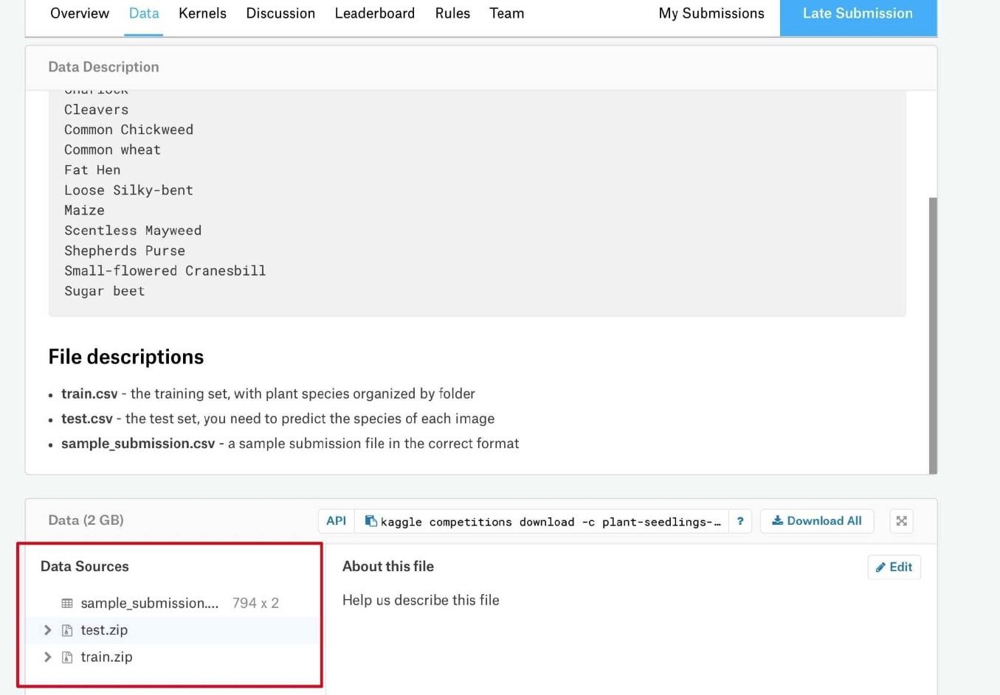

这是一个 [PyTorch](https://pytorch.org/) 的项目: a PyTorch Tutorial to Transfer Learning

这是 [a series of pytorch projects](https://github.com/L1aoXingyu/a-series-of-pytorch-projects) 中的第一个项目，从这个项目中我们会学习到如何使用迁移学习完成这个很棒的图像分类项目。

需要大家了解 PyTorch 的基本知识，同时要掌握卷积神经网络的知识。

项目使用 `PyTorch 1.0` 和 `python3.7`

**项目要求**:  
1. 找到代码中 `TODO` 部分，完成代码的内容，并训练网络 (`dataset.py` 和 `train.py`)
2. （可选）根据项目代码，自己从头写一个相似的项目作为练习
3. （可选）自己上网查阅或是阅读文章中[技巧](https://mp.weixin.qq.com/s/ANbD77zytD58bTwuXTvqjw)，对项目进行优化得到更好的结果

# 目录

[**Objective**](https://github.com/L1aoXingyu/a-PyTorch-Tutorial-to-Transfer-Learning#objective)

[**Concepts**](https://github.com/L1aoXingyu/a-PyTorch-Tutorial-to-Transfer-Learning#concepts)

[**Overview**](https://github.com/L1aoXingyu/a-PyTorch-Tutorial-to-Transfer-Learning#overview)

[**Implementation**](https://github.com/L1aoXingyu/a-PyTorch-Tutorial-to-Transfer-Learning#implementation)


# Objective
我们需要训练一个卷积神经网络来识别不同的植物种类。

在这个项目中，我们主要使用迁移学习和 fine-tune 的技术。

下面是几个例子，训练好的网络在测试集上的结果

<div align=center>

</div>

<div align=center>

</div>

<div align=center>

</div>

# Concepts

- **图像分类** 给定任何一张图片，这个任务的目标是在给定的候选label中预测一个概率最大的label或者是预测一个概率分布。在2012年以前，图像分类基本都是基于传统的图像处理方法，比如通过梯度算子和颜色直方图等信息手动提取特征，接着使用SVM等线性分类器进行分类。到了2012年深度学习方法横空出世，超越了传统方法非常多的分数，从此之后深度学习的方法逐步开始统治CV中应用。在图像分类领域，越来越多的卷积网络结构被提出来，比如VGG，InceptionNet，ResNet，DenseNet等等，同时这些网络都作为backbone应用到了检测和分割等任务上。

<div align=center>

</div>

- **softmax** 在数学上softmax也被称为归一化指数函数，是logistic函数从2维到高维的一个推广，能将任何实数k维向量z归一化到另外一个k维实向量$\sigma(z)$，使得向量中每一个元素都在(0, 1)之间，并且所有元素的求和为1。该函数通常的数学公式如下

<div align=center>

</div>

- **过拟合** Overfitting的概念在机器学习中非常重要，因为我们训练模型的最后目标是希望模型能够在没有见过的数据集上有良好的表现，而过拟合表示模型在训练集上表现远好于测试集上的结果。在实际建模中，特别是使用深度学习的模型，因为参数和特征的数目太多，而样本的数目相对较少，所以很容易出现过拟合的问题。实际中我们有很多方法来解决过拟合的问题，比如说数据增广，正则化，提前停止，dropout 等等。同时我们也可以画出训练集和测试集的曲线来找到过拟合的时间点。

<div align=center>

</div>

- **Fine Tune** 微调目前是计算机视觉中一个非常常见的技术，具体的做法就是给一个预训练(pretrained)模型，然而不同于从头训练，模型会基于预训练的权重开始在新的数据集上训练，这样可以省去大量的计算资源和计算时间，提高了计算效率。一般来讲我们都会使用在 ImageNet 的数据上预训练的模型，这个数据集使图像识别的超大数据库，整个数据集有1500万张图片，一共有1000类，所以使用这个数据集预训练的模型具有很好的泛化能力，已经具备了提取浅层基础特征和深层抽象特征的能力，同时因为参数已经在大的数据集上训练过，所以一定程度上可以解决过拟合的问题。实际中我们只需要替换最后一层全连接到我们的数据集中的类别数即可。

<div align=center>

</div>

# Overview
在这个部分，我们展示一下项目整体的逻辑和训练过程，帮助大家熟悉整个项目结构，如果你很熟悉这个部分，你可以直接跳到[implementation](https://github.com/L1aoXingyu/a-PyTorch-Tutorial-to-Transfer-Learning#implementation)

1. **定义数据读取**。对于所有的任务，第一步都需要熟悉任务的数据是什么样的类型，以及任务如何来读取数据，同时还要确定数据有哪些预处理，所以我们的第一步操作是定义数据读入，数据读入代码在 `dataset.py` 中，数据预处理的代码在 `train.py` 中。
2. **定义网络结构**。定义完数据相关的函数和类之后，我们需要定义适应于这个任务的模型，这是一个分类任务，所以可以使用常见的分类模型，比如 ResNet，InceptionNet 等等，选择好模型之后，需要根据任务修改最后的全连接层。
<div align=center>

</div>

3. **定义优化器和需要优化的参数**。在训练网络的时候，需要选择哪些参数需要更新，哪些参数固定不变，在 finetune 中，有三种基本的参数更新方式，一种是全部参数进行更新，一种是只更新最后一层全连接层的参数，一种是将卷积层的学习率设为全连接层的0.1或者0.01。然后需要选择一种梯度更新的方式，有标准的梯度下降法，也就大量的自适应梯度下降法。

4. **定义任务的损失函数**。定义好需要的优化参数之后，需要定义损失函数来计算梯度，这里的损失函数是分类的损失函数，公式如下          

$$
l_{CE} = - \sum_{i=1}^C t_i \log (y_i)
$$
其中 $y_i$ 是softmax之后的结果，$t_i$ 是 one-hot 的真实label。

5. **定义网络的训练逻辑**。这是一个分类任务，训练的逻辑可以用标准的随机梯度下降法，首先通过前向传播和损失函数的计算得到模型目前的 loss，然后通过反向传播得到可训练参数的梯度，最后通过梯度下降进行参数的更新，这样就完成了一次迭代。

6. **定义网络的测试和预测逻辑**。在网络的预测过程中，我们将图片输入到网络中，最后可以得到一个k-维向量，这个向量表示每个分类的得分，我们只需要取里面得分最大的下标作为预测的 label 即可，然后可以计算验证集的分类准确率，注意这里的向量每个元素求和并不等于 1，如果要等于 1，需要对向量进行 softmax 操作。

# Implementation
## 数据准备
通过[比赛界面](https://www.kaggle.com/c/plant-seedlings-classification/data)根据图片中的显示进行数据下载

<div align=center>

</div>

然后在项目的根目录中创建 `datasets` 文件夹，将下载好 `train.zip` 和 `test.zip` 文件放入 `datasets` 中

里面一共有12种不同的植物信息
```python
{'Black-grass', 'Charlock', 'Cleavers', 'Common Chickweed', 'Common wheat', 'Fat He', 'Loose Silky-bent', 'Maize', 'Scentless Mayweed', 'Shepherds Purse', 'Small-flowered Cranesbill', 'Sugar beet'}
```

通过 `utils/create_data_lists.py` 中的函数，我们可以按照比例将有标注的图片分成训练集和验证集，他们都是以`list`的方式存在，每个元素包含着图片的路径和对应的label，同时会得到一个字典`label2name`，里面包含着`0 ~ 11`这 12 个数字分别对应的具体上面的标签。

## 输入
在图片输入之前，需要通过 resize 操作将不同大小的图片都变成同一个大小，这样才能够组成一个 batch 输入到网络当中，一般我们可以 resize 到 `224, 224` 或者是 `299, 299` 作为网络的输入。

接着需要通过一系列数据增广的操作使得数据更加的多样化，比如随机裁剪，随机翻转等等，更多的增广方法具体看一看`torchvision.transforms`中的函数。
我们的数据增广定义在 `train.py` 中定义了`train_tfms`和`test_tfms`作为训练集和测试集的数据增广。

## 数据读取
需要在 `datasets.py` 中自定义了一个数据类，这是一个继承于 PyTorch `Dataset` 的子类，我们用来定义训练集和测试集，只需要定义`__len__`表示数据一共有多少， 和 `__getitem__`表示取出其中第 `i` 个数据点。

接着我们使用 PyTorch 中的 `DataLoader` 进行数据读取，这能够帮助我们方便的实现一个 `batch` 数据的读取，同时还能够利用python的多进程加快读取速度，其中 `num_workers`就是控制python进程数目。除此之外，还有一个参数是 `pin_memroy`，如果设置为 `True`，那么数据将会存放在锁业内存中，这样转换成GPU上的显存速度就会更快，如果电脑性能较差，可以设置为 `False`，将数据存放在虚拟内存中。

## 模型
下面需要在 `train.py` 中定义了输入的模型，这里可以使用任何的预训练模型，可以查看 `torchvision.models` 里面的模型，记得将最后的全连接层进行修改。

## Training
训练相关的函数和代码都在 `train.py` 中，需要同学们实现训练的基本逻辑，代码完成之后，通过运行下面的代码

```bash
python train.py 
```

就可以进行模型的训练了。 在训练过程中，会自动创建`logs/tmp`文件夹，训练的模型会自动保存在`logs/tmp/models`中。

## Evaluation
测试代码都在 `submission.py` 中，需要实现剩余的代码，通过载入训练好的模型，输入所有测试集的数据，经过模型得到预测的结果，然后进行结果的提交。

完成代码的补全之后，通过运行下面的代码

```
python submission.py --model_path='logs/tmp/model/model_best.pth' 
```

我们会在本地创建一个预测的结果 `submission.csv`，我们将这个文件提交到 kaggle，可以得到类似下面的比赛结果。

<div align=center>

</div>

通过这个结果可以判断你的模型性能的好坏。

## Inference
我们的预测代码在 `inference.py` 中实现，补全 `classify_plant()` 中的代码，然后通过运行下面的代码就可以进行图片的预测了。

```python
img_path = 'path/to/image'
origin_image = PIL.Image.open(img_path).convert('RGB')

pred_label, scores = classify_plant(origin_image)
```
通过这个函数就可以得到模型对输入图片预测的结果以及预测的置信度。
