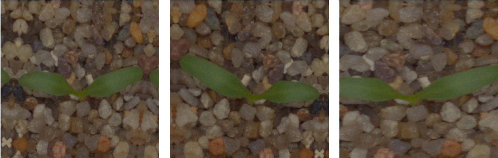

这是一个 [PyTorch](https://pytorch.org/) 的教程: a PyTorch Tutorial to Transfer Learning

这是 [a series of projects]() 中的第一个项目，从这个项目中我们会学习到如何使用迁移学习完成这个很棒的图像分类项目。

需要大家了解 PyTorch 的基本知识，同时要掌握卷积神经网络的知识。

项目使用 `PyTorch 1.0` 和 `python3.7`

# 目录

[**Objective**](https://github.com/L1aoXingyu/a-PyTorch-Tutorial-to-Transfer-Learning#objective)

[**Concepts**](https://github.com/L1aoXingyu/a-PyTorch-Tutorial-to-Transfer-Learning#concepts)

[**Overview**](https://github.com/L1aoXingyu/a-PyTorch-Tutorial-to-Transfer-Learning#overview)

[**Implementation**](https://github.com/L1aoXingyu/a-PyTorch-Tutorial-to-Transfer-Learning#implementation)

[**Training**](https://github.com/L1aoXingyu/a-PyTorch-Tutorial-to-Transfer-Learning#training)

[**Evaluation**](https://github.com/L1aoXingyu/a-PyTorch-Tutorial-to-Transfer-Learning#evaluation)

[**Inference**](https://github.com/L1aoXingyu/a-PyTorch-Tutorial-to-Transfer-Learning#inference)


# Objective
我们需要训练一个卷积神经网络来识别不同的植物种类。

在这个项目中，我们主要使用迁移学习和 fine-tune 的技术。

下面是几个例子，训练好的网络在测试集上的结果

<div align=center>

</div>

<div align=center>

</div>

<div align=center>

</div>

# Concepts

- **图像分类** 给定任何一张图片，这个任务的目标是在给定的候选label中预测一个概率最大的label或者是预测一个概率分布。在2012年以前，图像分类基本都是基于传统的图像处理方法，比如通过梯度算子和颜色直方图等信息手动提取特征，接着使用SVM等线性分类器进行分类。到了2012年深度学习方法横空出世，超越了传统方法非常多的分数，从此之后深度学习的方法逐步开始统治CV中应用。在图像分类领域，越来越多的卷积网络结构被提出来，比如VGG，InceptionNet，ResNet，DenseNet等等，同时这些网络都作为backbone应用到了检测和分割等任务上。

<div align=center>

</div>

- **softmax** 在数学上softmax也被称为归一化指数函数，是logistic函数从2维到高维的一个推广，能将任何实数k维向量z归一化到另外一个k维实向量$\sigma(z)$，使得向量中每一个元素都在(0, 1)之间，并且所有元素的求和为1。该函数通常的数学公式如下

$$
\sigma(z)_j = \frac{e^{z_j}}{\sum_{k=1}^K e^{z_K}} \  for j = 1, \cdots, K
$$

<div align=center>

</div>

- **过拟合** Overfitting的概念在机器学习中非常重要，因为我们训练模型的最后目标是希望模型能够在没有见过的数据集上有良好的表现，而过拟合表示模型在训练集上表现远好于测试集上的结果。在实际建模中，特别是使用深度学习的模型，因为参数和特征的数目太多，而样本的数目相对较少，所以很容易出现过拟合的问题。实际中我们有很多方法来解决过拟合的问题，比如说数据增广，正则化，提前停止，dropout 等等。同时我们也可以画出训练集和测试集的曲线来找到过拟合的时间点。

<div align=center>

</div>

- **Fine Tune** 微调目前是计算机视觉中一个非常常见的技术，具体的做法就是给一个预训练(pretrained)模型，然而不同于从头训练，模型会基于预训练的权重开始在新的数据集上训练，这样可以省去大量的计算资源和计算时间，提高了计算效率。一般来讲我们都会使用在 ImageNet 的数据上预训练的模型，这个数据集使图像识别的超大数据库，整个数据集有1500万张图片，一共有1000类，所以使用这个数据集预训练的模型具有很好的泛化能力，已经具备了提取浅层基础特征和深层抽象特征的能力，同时因为参数已经在大的数据集上训练过，所以一定程度上可以解决过拟合的问题。实际中我们只需要替换最后一层全连接到我们的数据集中的类别数即可。

<div align=center>

</div>

# Overview
在这个部分，我们展示一下整体的模型结构，如果你很熟悉这个部分，你可以直接跳到[implementation](https://github.com/L1aoXingyu/a-PyTorch-Tutorial-to-Transfer-Learning#implementation)

## Base Convolutions
首先，我们使用目前存在的神经网络结构作为例子，这里我们使用 ResNet50 作为例子，也可以尝试使用不同的网络结构。

<div align=center>

</div>

我们会保留完整的网络结构，除了最后一层，我们会用一个新的全连接层去替换最后一层，实现我们需要的分类效果。

## Loss 函数
对于分类问题，我们使用最常用的交叉熵损失函数，公式如下

$$
l_{CE} = - \sum_{i=1}^C t_i \log (y_i)
$$

其中 $y_i$ 是softmax之后的结果，$t_i$ 是 one-hot 的真实label。

## 处理预测过程
在网络的预测过程中，我们将图片输入到网络中，最后可以得到一个k-维向量，这个向量表示每个分类的得分，我们只需要取里面得分最大的下标作为预测的label即可，注意这里的向量每个元素求和并不等于1，如果要等于1，需要对向量进行softmax操作。

# Implementation
## 数据准备
通过[比赛界面](https://www.kaggle.com/c/plant-seedlings-classification/data)根据图片中的显示进行数据下载

<div align=center>

</div>

然后在项目的根目录中创建`datasets`文件夹，将下载好`train.zip`和`test.zip`文件放入`datasets`中

里面一共有12种不同的植物信息
```python
{'Black-grass', 'Charlock', 'Cleavers', 'Common Chickweed', 'Common wheat', 'Fat He', 'Loose Silky-bent', 'Maize', 'Scentless Mayweed', 'Shepherds Purse', 'Small-flowered Cranesbill', 'Sugar beet'}
```

通过 `utils/create_data_lists.py` 中的函数，我们可以按照比例将有标注的图片分成训练集和验证集，他们都是以`list`的方式存在，每个元素包含着图片的路径和对应的label，同时会得到一个字典`label2name`，里面包含着`0 ~ 11`这 12 个数字分别对应的具体上面的标签。

## 输入
我们将图片都 resize 到 `224, 224` 作为网络的输入，同时每张图片的读入都是 RBG 的格式。

接着我们通过一系列数据增广的操作，比如随机裁剪，随机翻转等等，更多的增广方法具体看一看`torchvision.transforms`中的函数。
我们的数据增广定义在 `train.py` 中定义了`train_tfms`和`test_tfms`作为训练集和测试集的数据增广。
`train_tfms`主要使用了`RandomResizedCrop`和`RandomHorizontalFlip`，首先在[3/4-4/3]中随机挑选一个比例进行resize，然后再[0.08-1]之间随机选择一个尺寸进行crop，最后在resize到输入大小，然后在随机水平翻转。
`test_tfms`就是直接将图片resize到了输入的大小。

下面是我们通过数据增广的三个例子

<div align=center>

</div>

最后我们将输入的像素点标准化到[0, 1]之间，然后用 ImageNet 的均值和方差做标准化
```
mean = [0.485, 0.456, 0.406]
std = [0.229, 0.224, 0.225]
```

## 数据读取
我们在`datasets.py`中自定义了一个数据类，这是一个继承于 PyTorch `Dataset` 的子类，我们用来定义训练集和测试集，只需要定义`__len__`表示数据一共有多少， 和 `__getitem__`表示取出其中第 `i` 个数据点。

接着我们使用 PyTorch 中的 `DataLoader` 进行数据读取，这能够帮助我们方便的实现一个 `batch` 数据的读取，同时还能够利用python的多进程加快读取速度，其中 `num_workers`就是控制python进程数目。除此之外，还有一个参数是 `pin_memroy`，如果设置为 `True`，那么数据将会存放在锁业内存中，这样转换成GPU上的显存速度就会更快，如果电脑性能较差，可以设置为 `False`，将数据存放在虚拟内存中。

## 模型
我们再 `model.py` 中定义了输入的模型 `ResNet50`，通过 `net.fc = nn.Linear(net.fc.in_features, classes)` 实现了最后一层的替换。

# Training
我们的训练脚本都在 `train.py` 中实现了，通过运行下面的代码

```bash
python train.py 
```

就可以进行baseline训练, 在训练过程中，会自动创建`logs/tmp`文件夹，训练的模型会自动保存在`logs/tmp/models`中。

损失函数我们使用的是交叉熵`nn.CrossEntropyLoss()`, 优化器选用了 `Adam`，学习率初始为`0.1`，一共训练`120`epochs，分别在`60`和`90`次进行学习率的0.1倍的衰减，`weight_decay` 选择了 `5e-4`。

所有的模型训练参数都可以在 `main` 函数的 `parser` 中查看。

# Evaluation
我们的测试脚本在 `submission.py` 中实现了，通过载入训练好的模型，输入所有测试集的数据，经过模型得到预测的结果，然后进行结果的提交。

运行下面的代码

```
python submission.py --model_path='logs/tmp/model/model_best.pth' 
```

我们会在本地创建一个预测的结果 `submission.csv`，我们将这个文件提交到 kaggle，可以得到类似下面的比赛结果。

<div align=center>

</div>

通过这个结果可以判断你的模型性能的好坏。

# Inference
我们的推理脚本在 `inference.py` 中实现了，首先在开头载入训练好的模型，然后可以使用 `classify_plant()` 函数进行图片的预测。

```python
img_path = 'path/to/image'
origin_image = PIL.Image.open(img_path).convert('RGB')

pred_label, scores = classify_plant(origin_image)
```
通过这个函数就可以得到模型对输入图片预测的结果以及预测的置信度。
